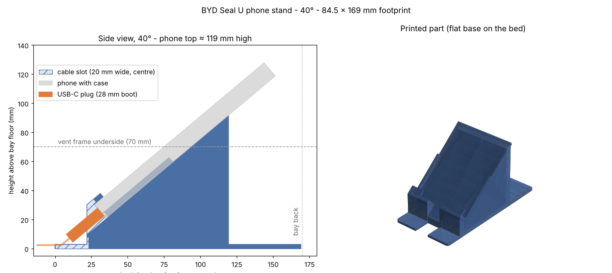

# מעמד טלפון ל-BYD Seal U DM-i / Seal U phone stand

מעמד שנכנס ל**תא הטעינה האלחוטית השמאלי** בקונסולה (הקרוב להגה) ומחזיק
טלפון אחד לאורך, נטוי לאחור, עם המסך כלפי הנהג. **בלי הדבקה ובלי תפס
למזגן** — הבסיס יושב בתוך הבליטות הגומי של התא ונעצר בהן מכל הצדדים.

A drop-in stand for the left wireless-charging bay of the BYD Seal U DM-i
centre console. Held by the bay's rubber tabs only: no adhesive, no vent clip.



## קבצים / Files

| קובץ | זווית מהרצפה | גובה המעמד | גובה קצה הטלפון | הערות |
|------|--------------|-------------|-------------------|-------|
| [fit_test_plate.stl](stl/fit_test_plate.stl) | — | 2 מ"מ | — | **להדפיס קודם** (~15 דק') ולבדוק שנכנס לתא |
| [seal_u_phone_stand_35deg.stl](stl/seal_u_phone_stand_35deg.stl) | 35° | 84 מ"מ | ~108 מ"מ | הכי שכוב; הטלפון מגיע ~1 ס"מ מהקיר האחורי |
| [seal_u_phone_stand_40deg.stl](stl/seal_u_phone_stand_40deg.stl) | 40° | 92 מ"מ | ~119 מ"מ | **ברירת מחדל** |
| [seal_u_phone_stand_45deg.stl](stl/seal_u_phone_stand_45deg.stl) | 45° | 99 מ"מ | ~128 מ"מ | הכי זקוף |

תצוגות: [35°](stl/seal_u_phone_stand_35deg_preview.png) ·
[40°](stl/seal_u_phone_stand_40deg_preview.png) ·
[45°](stl/seal_u_phone_stand_45deg_preview.png)

## מידות / Dimensions

- **בסיס:** 84.5 × 169 מ"מ (התא בין הבליטות: 85 × 170), פינות מעוגלות.
- **עריסה:** 78 מ"מ בין הדפנות, מרווח 12.5 מ"מ לעובי — מתאים לאייפון 14 פרו
  ולגלקסי S24 / S25 עם כיסוי (עד 12 מ"מ עובי, ~76 מ"מ רוחב).
- **תמיכה:** משטח גב באורך 110 מ"מ; דפנות צד נמוכות (4 מ"מ) רק ב-60 המ"מ
  התחתונים, כדי לא ללחוץ על כפתורי הצד. שפה קדמית רק בפינות — תחתית המסך פנויה.
- **כבל טעינה:** חריץ ברוחב 20 מ"מ באמצע המדף, פתוח קדימה, כך שאפשר לחבר
  את הכבל לטלפון ואז להניח את הטלפון במעמד והכבל "נופל" לחריץ. הכבל יוצא
  מקדמת המעמד דרך פתח בבסיס ושוכב על רצפת התא.
  - **בדוק בקוד** (`check_cable_fit`, רץ בכל יצירה): תקע עם ראש קשיח עד
    **28 מ"מ** אורך (מפני הכיסוי והחוצה), עד 13 × 7.5 מ"מ, לא נוגע במעמד ולא
    ברצפת התא, בכל גובה שקע 4.5–6.5 מ"מ מגב הכיסוי ובהזזה של ±1.5 מ"מ לצדדים.
  - ראש ארוך יותר (או חוט עבה וקשיח) — עדיף כבל עם תקע 90°.
  - בזווית הזאת הטעינה האלחוטית של התא לא מגיעה לטלפון.
- **שימו לב:** קצה הטלפון העליון עומד מול הלמלות התחתונות של פתח המזגן
  השמאלי (המסגרת הכסופה מתחילה בגובה 70 מ"מ מהרצפה).

## הדפסה ב-Bambu Lab P2S

1. **קודם פלטת הבדיקה.** אם היא צמודה מדי/רופפת — לשנות `FIT` בסקריפט
   (0.25 מ"מ לכל צד) ולהריץ מחדש.
2. **כיוון:** כפי שהקובץ נטען — הבסיס השטוח על המשטח. **בלי תמיכות**
   (כל השיפועים 40°–50°, החריץ והתעלה הם גשרים קצרים).
3. **חומר:** **PETG או ASA** — לא PLA (מתעוות באוטו חם בקיץ).
4. **מילוי:** 15–20%, 3 קירות, שכבה 0.2 מ"מ. בערך 80–100 גרם.

## שינוי מידות / Changing dimensions

כל המידות הן קבועים בראש [`generate_holder.py`](generate_holder.py)
(`P0`, `SUPPORT_L`, `PHONE_T`, `VARIANTS` וכו').

```bash
pip install -r phone-holder/requirements.txt
python3 phone-holder/generate_holder.py        # כל הגרסאות
python3 phone-holder/generate_holder.py 40     # רק 40°
```
